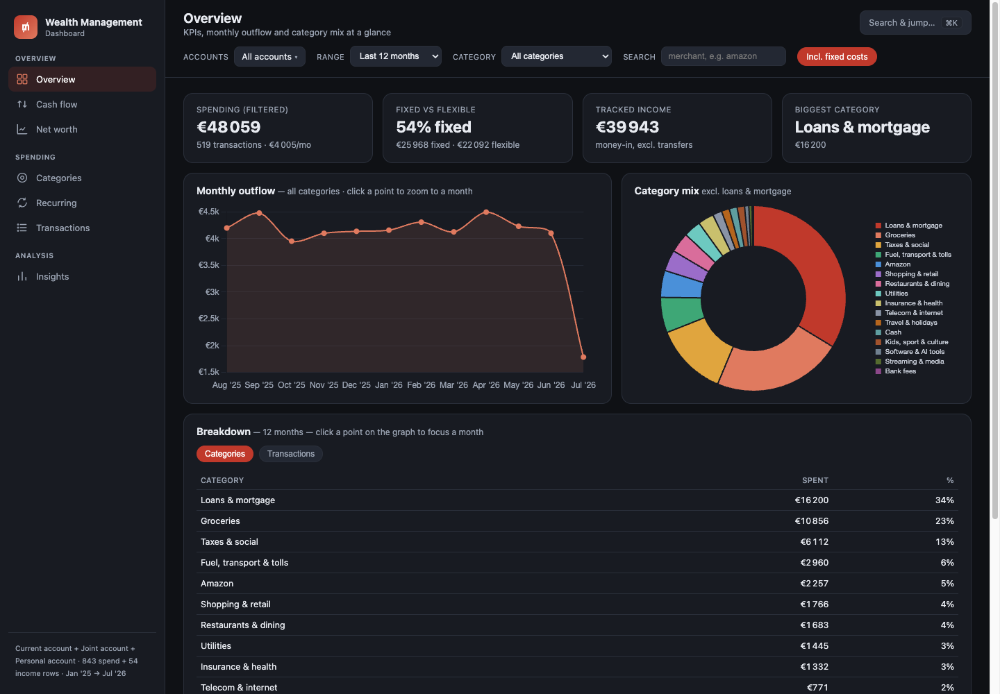

# Wealth Dashboard

Self-hosted personal-finance automation built for Europe. Syncs bank accounts (PSD2 open banking via [Enable Banking](https://enablebanking.com), which covers 2,500+ banks across the EEA and UK) and Interactive Brokers into a local SQLite database, categorises transactions with an editable rule engine, and renders a zero-dependency single-file HTML dashboard: spending, income, net worth, and a weekly email-style digest.

**No cloud, no third-party aggregator storing your data.** Everything runs locally on a schedule (macOS launchd); the only external calls are to your bank's PSD2 API and IBKR Flex.



## Demo

Open [`demo/dashboard.html`](demo/dashboard.html) — built entirely from synthetic data. Generate your own:

```bash
cd automation
python3 sample_data.py        # seeds wealth.db with ~900 synthetic transactions
python3 build_dashboard.py    # renders ../Wealth-Management-Dashboard.html
```

## Architecture

```
Enable Banking (PSD2) ─┐
IBKR Flex Query ───────┼─▶ sync.py ─▶ wealth.db (SQLite) ─▶ build_dashboard.py ─▶ dashboard.html
Bank .xls exports ─────┘                    │
                                            └─▶ digest.py ─▶ weekly-digest.html
```

- **`sync.py`** — daily sync: pulls transactions + balances from all providers, dedupes on provider IDs, auto-imports bank `.xls` exports dropped in Downloads (a fallback for banks with unreliable PSD2 feeds).
- **`categorize.py`** — rule-based merchant extraction & categorisation of raw bank labels (`CARTE 12/03 E.LECLERC…` → *Groceries*). The rule table is plain data — the shipped rules are tuned for French banks; edit them for your bank's label format. Your own patterns (e.g. internal transfers between family members) live in `config.json`, not in code.
- **`db.py`** — one-file SQLite store. Balance snapshots keep min/max/close per day, so year-max and year-end balances for tax reporting (e.g. US FBAR, French IFI) fall out of a query.
- **`build_dashboard.py`** — injects the data as JSON into `dashboard_shell.html`; the output is a single self-contained HTML file, no server needed.
- **`digest.py`** — weekly spending digest.
- **`tax_report.py`**, **`reconcile.py`**, **`reconstruct_balances.py`** — year-end tax figures, sanity checks, and balance back-filling from transaction history.

## Setup

See [`automation/SETUP.md`](automation/SETUP.md). Short version:

```bash
cd automation
python3 -m venv .venv && .venv/bin/pip install -r requirements.txt
cp config.example.json config.json     # add Enable Banking app id + IBKR Flex token
python3 link_banks.py                  # OAuth-style bank consent flow
python3 sync.py                        # first sync pulls up to 2 years of history
```

Scheduling: on macOS, edit the paths in `com.wealth.sync.plist` / `com.wealth.digest.plist` and load them with `launchctl`. On Linux, a cron entry or systemd timer running `sync.py` daily does the same job — the pipeline itself is plain Python.

## Adapting it to your bank & country

The pipeline is bank-agnostic; a few pieces ship tuned to the author's setup and are meant to be edited:

- **Bank coverage** — any bank supported by Enable Banking links live; list yours (with its country code) in `config.json → enable_banking.banks`.
- **Categorisation rules** — `categorize.py`'s `RULES` table is keyword data, not logic. The shipped rules target French merchant labels; swap in keywords for your bank's format and re-run `sync.py` to re-label everything.
- **Manual-import fallback** — some banks have broken PSD2 feeds. `import_bnp.py` handles BNP Paribas' `.xls` export and doubles as a ~60-line template for writing an importer for any bank's export format.
- **Base currency** — EUR, so eurozone users work out of the box; USD accounts (like IBKR) are converted at the EUR/USD rate from the Flex report. A non-euro base currency (GBP, SEK…) currently means editing the `€` formatting in `dashboard_shell.html` / `digest.py` and the FX handling in `sync.py`.
- **Demo data** — the synthetic dataset simulates typical French accounts so the categoriser has something realistic to chew on; it's flavour, not a requirement.

## Privacy

`config.json` (API credentials, bank session IDs), `wealth.db`, `assets.json`, logs, and generated dashboards are all gitignored. The repo contains code and synthetic demo data only.

## License

MIT
